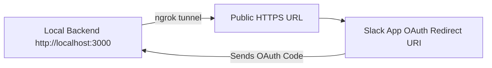

# Slack Connect App

A full-stack Slack Connect app that integrates OAuth 2.0, token management, and scheduled message delivery.

---

## 📁 Repository Structure

```
root/
├── backend/               # Express + Prisma backend
│   ├── src/
│   ├── prisma/
│   └── .env
├── frontend/              # React + TypeScript frontend
│   ├── src/
│   └── .env
├── README.md
└── ...
```

---

## 🔧 Setup Instructions

### 1. Clone the Repository
```bash
git clone https://github.com/your-username/slack-connect-app.git
cd slack-connect-app
```

### 2. Backend Setup
```bash
cd backend
npm install
cp .env.example .env
```

#### Fill `.env` with:
```
PORT=3000
DATABASE_URL=file:./dev.db   # or your PostgreSQL URL
SLACK_CLIENT_ID=xxxx
SLACK_CLIENT_SECRET=xxxx
SLACK_REDIRECT_URI=https://<ngrok-public-url>/api/slack/callback
```

```bash
npx prisma generate
npx prisma migrate dev --name init
npx ts-node src/index.ts
```

### 3. Frontend Setup
```bash
cd ../frontend
npm install
cp .env.example .env
```

#### Fill `.env` with:
```
VITE_BACKEND_URL=https://<ngrok-public-url>
```

```bash
npm run dev
```

---

## 🌐 ngrok Role in Development

Slack requires an **HTTPS public URL** for OAuth callbacks — it does not accept plain `http://localhost`.  
We used **ngrok** to expose the local backend over HTTPS for Slack to communicate with.



### ngrok Setup Commands
```bash
# Start backend first
npx ts-node src/index.ts

# In a new terminal
ngrok http 3000
```

**Steps After ngrok Starts**:
1. Copy the HTTPS URL ngrok provides (e.g. `https://abc123.ngrok-free.app`)
2. Update `SLACK_REDIRECT_URI` in your backend `.env` file:
   ```
   SLACK_REDIRECT_URI=https://abc123.ngrok-free.app/api/slack/callback
   ```
3. Go to **Slack App → OAuth & Permissions → Redirect URLs**
   - Add the same ngrok URL + `/api/slack/callback`
4. Save changes and reinstall the Slack app to your workspace.

---

## 🏗️ Architecture Overview

### ✅ OAuth Flow
- User clicks **“Connect Slack Workspace”** → Redirects to Slack Auth URL
- On successful login, Slack redirects to `/api/slack/callback`
- App exchanges code for an access token
- Token stored in Prisma (SQLite/PostgreSQL)
- Scheduled and immediate messages sent via Slack API

### ⏰ Scheduled Messages
- Cron job runs every minute using `node-cron`
- Fetches scheduled messages from DB and sends them via Slack API

---

## 🐞 Troubleshooting

- **Backend shuts down automatically**:  
  Check for unhandled promise rejections. Run backend and ngrok in separate terminals.

- **Slack OAuth error: `invalid_redirect_uri`**:  
  Ensure the URL in `.env` matches exactly in Slack App’s Redirect URLs.

- **ngrok URL changes every time**:  
  Each restart generates a new URL — update `.env` and Slack settings every time.

- **Alternative to ngrok**:  
  `npx localtunnel --port 3000 --subdomain myapp` (less stable for Slack OAuth)

---

## 📎 Useful Links
- [Slack App Dashboard](https://api.slack.com/apps)


---

## 📬 Contact
Made with ❤️ by [Ashutosh jha](https://github.com/ashutoshjha31).
